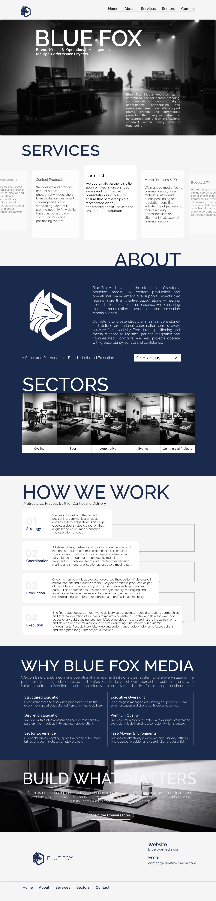
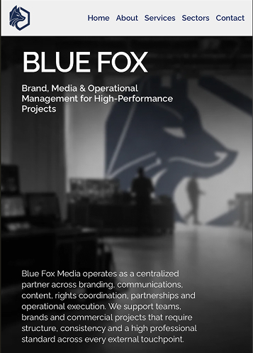
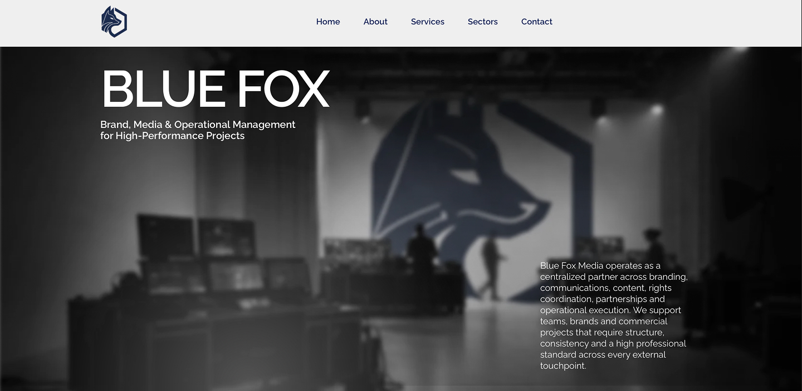

# Blue Fox Media — Design to Development Case

A premium agency landing page created as a full-cycle client project.

## Project Pipeline
- UI/UX design in Figma
- Layout system and responsive structure
- Frontend development (HTML / CSS / JavaScript)
- Tilda T123 custom code integration
- Production launch with domain, SSL and favicon setup

## Design Stage
The project started with a custom Figma interface system focused on:
- premium visual hierarchy
- agency-style typography
- dark luxury sections
- responsive mobile adaptation
- strong CTA structure

## Development Stage
The approved design was fully transformed into production-ready code:
- semantic HTML5
- modular CSS architecture
- custom services slider
- hero parallax
- magnetic hover effects
- process reveal animations
- responsive breakpoints
- Safari / Tilda compatibility fixes

## Live Website
http://bluefox-media.com

# Design Stage

## Desktop UI

## Mobile UI

# Development Stage

## Live Website

